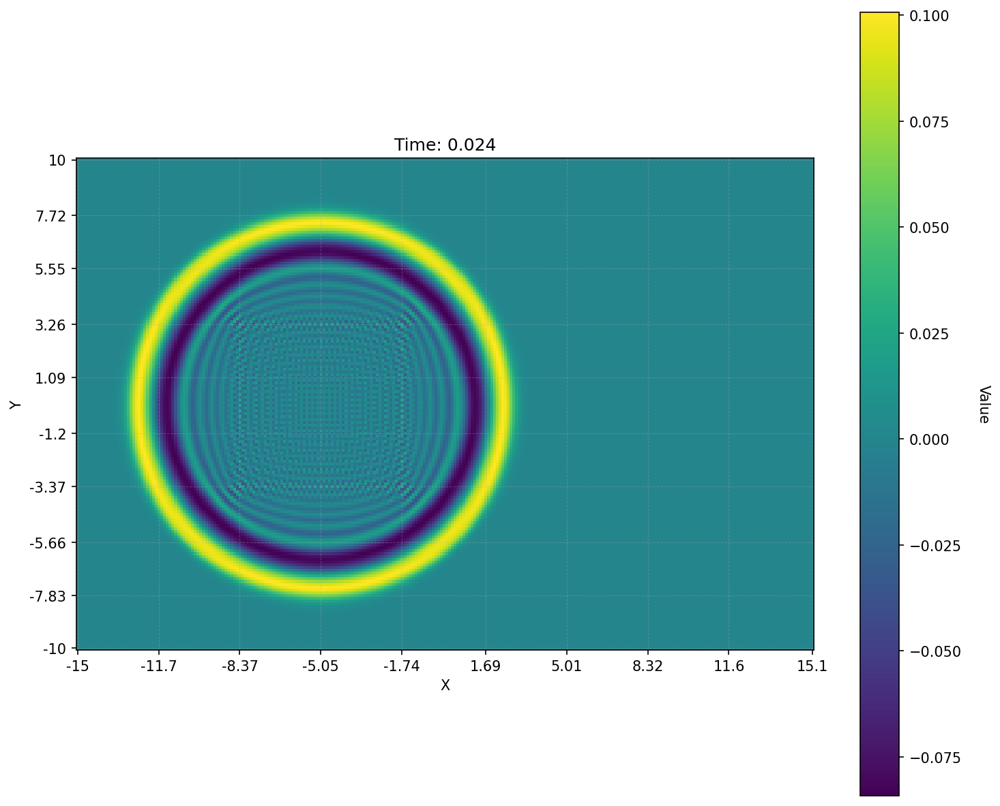

## Acoustic (C++/CUDA FDTD simulator)

This project implements a 2D acoustic wave simulator using a finite-difference time-domain (FDTD) scheme.
It is **developed and tested primarily on Linux** with NVIDIA GPUs and CUDA.

> **Disclaimer:** This codebase started as an experiment to learn CUDA and GPU programming.  
> As a result, some design and implementation choices may be suboptimal or more exploratory than
> production-grade; treat it as a learning/experimental project rather than a polished library.

The simulator reads a simple text input file (see `sample_input.txt`), constructs the domain (source,
bounding box, walls, material properties, simulation parameters), runs the time-marching scheme on
the GPU or CPU, and writes results into an `acoustic.db` directory.

---

## Requirements (Linux)

- **Operating system**: Linux (x86_64)
- **Compiler**: C++17-capable compiler (e.g. `g++` 11+ or Clang with C++17)
- **Build system**: `cmake` ≥ 3.20
- **CUDA**:
  - NVIDIA GPU with a supported compute capability
  - CUDA Toolkit installed and available on the system
- **Python (optional)**: Python 3 with NumPy for `compare_out.py`

The CMake project is configured for C, C++ and CUDA and will fail to configure if the CUDA toolkit
cannot be found.

---

## Building on Linux

### Option 1: Using the helper script (recommended)

From the repository root:

```bash
./compile.sh
```

This will:

- Configure a **Release** build in the `build/` directory.
- Build the main executable and the unit tests.

After a successful build you should have at least:

- `build/acoustic` – main simulation executable
- `build/ut` (or similar) – unit test executable

### Option 2: Using CMake directly

From the repository root:

```bash
cmake -B build -DCMAKE_BUILD_TYPE=Release
cmake --build build
```

For a debug build:

```bash
cmake -B build -DCMAKE_BUILD_TYPE=Debug
cmake --build build
```

To enable extra CUDA debugging information:

```bash
cmake -B build -DCMAKE_BUILD_TYPE=Debug -DENABLE_CUDA_DEBUG=ON
cmake --build build
```

---

## Running a simulation

Assuming you have built into `build/` as above, a simple way to run the sample case is:

```bash
cd build
./acoustic ../sample_input.txt
```

The program will:

- Parse the input file (`sample_input.txt` is a good starting example).
- Check that the input is sane.
- Create an `acoustic.db` directory (removing any existing one).
- Run the simulation (CPU or GPU, depending on the `SimulationParam` line).
- Save data into the `acoustic.db` directory and print some diagnostic information to stdout.

**Input variables and `$NAME` expansion**

The input parser understands tokens that start with `$` and replaces them using environment
variables before interpretation. For example, if the input file contains `$PROCESSING_TYPE` and
the environment variable `PROCESSING_TYPE` is set to `GPU`, the parser will substitute
`$PROCESSING_TYPE` with `GPU`. The provided `sample_input.txt` uses this mechanism for
`$MAX_ITERATION`, `$PROCESSING_TYPE`, `$BLOCK_X_SIZE`, and `$BLOCK_Y_SIZE`.

### Convenience run script

There is a small helper script `run.sh` which wraps the executable and sets a few environment
variables used by `sample_input.txt`:

```bash
./run.sh <MAX_ITERATION> <PROCESSING_TYPE> <BLOCK_X_SIZE> <BLOCK_Y_SIZE>
```

Where:

- `MAX_ITERATION` – number of time steps
- `PROCESSING_TYPE` – `CPU` or `GPU`
- `BLOCK_X_SIZE`, `BLOCK_Y_SIZE` – CUDA block dimensions

The script:

- Exports these values as environment variables (used by `sample_input.txt`).
- Runs `./acoustic sample_input.txt` and saves the console output to `output.log`.
- Moves `acoustic.db` and `output.log` into a directory named `<PROCESSING_TYPE>.<MAX_ITERATION>`.

You can also run multiple configurations via `run.all`, which simply calls `run.sh` with a range
of `(MAX_ITERATION, PROCESSING_TYPE)` combinations.

---

## Benchmarking and profiling (Linux + CUDA)

The `benchmark.sh` and `benchmark_all.sh` scripts are intended for GPU performance profiling
using NVIDIA Nsight Compute (`ncu`):

- `benchmark.sh` runs a single configuration:

  ```bash
  ./benchmark.sh <BLOCK_X_SIZE> <BLOCK_Y_SIZE>
  ```

  It:
  - Sets `MAX_ITERATION` and `PROCESSING_TYPE=GPU` internally.
  - Runs `ncu` on `./acoustic sample_input.txt`.
  - Stores the profiler report and log as `profile_<BLOCK_X>_<BLOCK_Y>.ncu-rep` and
    `profile_output_<BLOCK_X>_<BLOCK_Y>.log`.

- `benchmark_all.sh` sweeps over many `(BLOCK_X, BLOCK_Y)` pairs and writes all profiles into
  the `bench_results/` directory.

These scripts assume:

- `acoustic` is built and available in the current working directory.
- Nsight Compute is installed and accessible as `/usr/local/cuda-13.0/bin/ncu` (adjust paths
  as needed for your system).

---

## Comparing simulation outputs

The script `compare_out.py` can be used to compare two database files produced by
`Simulator::potentiallySaveTheMatricesToDb()`:

```bash
python3 compare_out.py <reference.db> <candidate.db>
```

It will:

- Parse header information (time, grid coordinates, matrix dimensions).
- Verify that headers match.
- Compute relative and absolute error statistics between the two matrices.
- Report summary statistics (min/mean/max, percentiles, etc.).

This is useful when validating numerical changes, GPU vs CPU implementations, or refactors.

---

## Visualizing acoustic pressure (colormaps)

The script `create_colormap.py` can be used to visualize the acoustic pressure fields saved
by the simulator as DenseMatrix `.db` files.

- **Single file:**

  ```bash
  python3 create_colormap.py iteration_10.db [output.png]
  ```

  If `output.png` is omitted, the script will open an interactive window instead of saving to disk.

- **All `.db` files in a directory:**

  ```bash
  python3 create_colormap.py --all [output_dir]
  ```

  This will scan the current directory for `*.db` files, create a colormap image for each, and
  write them into `output_dir` (or the current directory if `output_dir` is omitted).

Each colormap uses the grid information stored in the file (x/y coordinates) to label axes and
colors represent pressure values, giving a quick visual overview of the simulated acoustic field.



---

## Tests

Unit tests are built into the `ut` executable via CMake. After configuring the project:

```bash
cd build
cmake --build .
ctest
```

Or run the test binary directly:

```bash
cd build
./ut
```

Tests use GoogleTest (downloaded automatically via `FetchContent` in `CMakeLists.txt`) and cover
components such as the input parsing, utilities, and grid logic.

---

## Project structure (high level)

- `main.cpp` – program entry; parses arguments and starts the runner.
- `runner.{h,cpp}` – orchestrates parsing, sanity checks, simulation setup, and execution.
- `input_file_parser.{h,cpp}` – low-level input file parsing utilities.
- `input_compiler.{h,cpp}` – converts parsed statements into a structured representation.
- `input_cnt.{h,cpp}` – container for input statements and derived quantities.
- `grid.{h,cpp}` – spatial grid representation.
- `simulator.{h,cpp}` – main simulation loop and interaction with CUDA kernels.
- `simulator_kernels.cu` / `cuda_utilities.cu` / `cuda_array.h` / `cuda_dense_matrix.h` – CUDA-side
  data structures and kernels.
- `utilities.{h,cpp}` – miscellaneous helpers (including performance timing).
- `sample_input.txt` – example input file used by the helper scripts.
- `compare_out.py` – offline result comparison tool.
- `benchmark.sh`, `benchmark_all.sh` – GPU profiling and performance sweeps.

Legacy or auxiliary scripts for other platforms may exist in the repository, but the **primary,
supported, and tested environment is Linux with CMake and CUDA**.

---

## TODO / Future work

- [ ] Currently, GPU is heavily under-utilized (a bit natural given the relatively small number of grid points; 2D). Explore doing multiple time steps at each kernel launch. It should increase compute intensity.
- [ ] Every timestep the control switches between CPU to GPU and back. Explore graphs? Or events?
- [ ] Run-time block parameters get translated to compile-time using the variadic template trick. Move it higher to the hierarchy.
- [ ] Revisit the CUDA allocation under the light of the read for unified memory